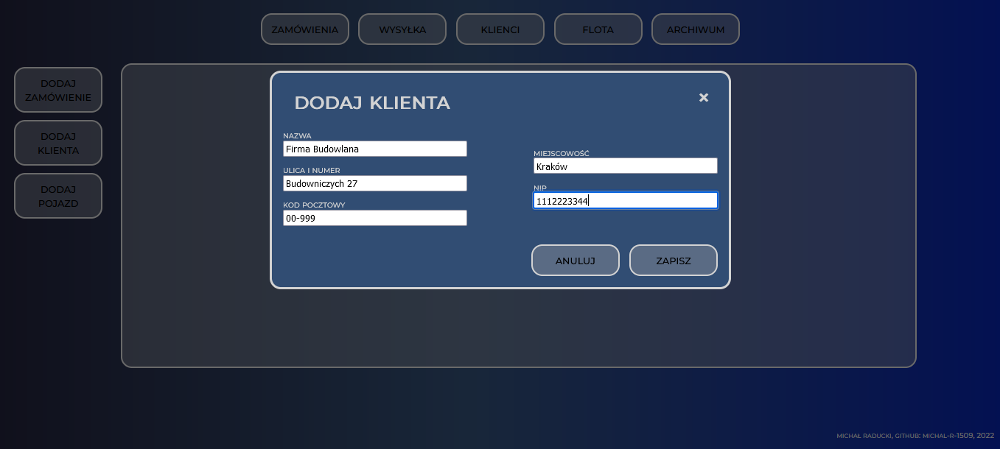
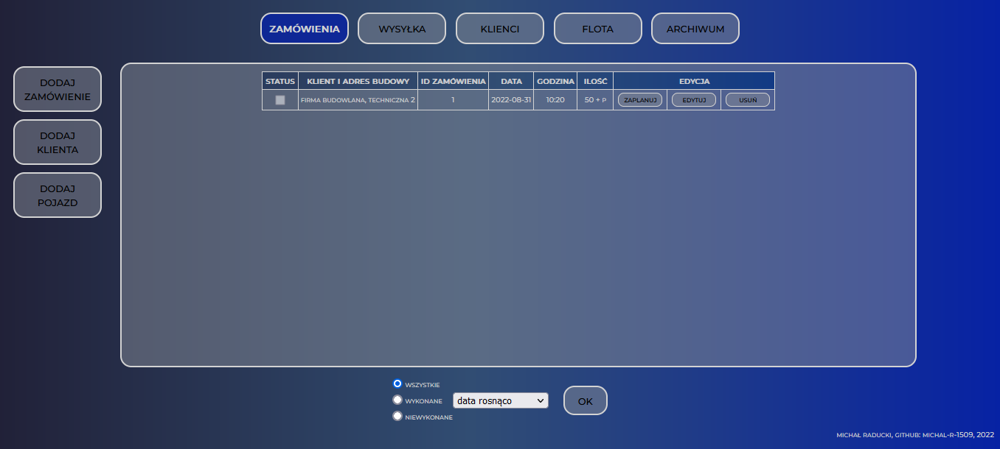

## CONCRETE PLANT MANAGEMENT

Aplikacja do zarządzania zamówieniami w betoniarniach

Application for managing orders for concrete plants  

### OPIS APLIKACJI

Apilikacja do rejestrowania zamówień oraz planowania wysyłki 
partii betonu na plac budowy. Tworzy bazę klientów oraz pojazdów 
betoniarni. Ponadto, generuje odpowiednie dokumenty WZ 
(Wydanie Zewnętrzne) przeznaczone do okazania i podpisu
przez odbiorców zamówienia.

####OPIS UŻYTKOWANIA

Założeniem aplikacji jest rejestrowanie zamówień przyjmowanych
od wcześniej zdefiniowanych klientów, a następnie dysponowanie 
pojedynczych partii betonu na budowę z użyciem pojazdów zawartych 
w bazie danych. 

Przed rozpoczęciem pracy należy zdefiniować pojazdy będące
w posiadaniu betoniarni. Przyjmujący zamówienie 
powinien także wcześniej wprowadzić klienta do bazy.

Zapisane do bazy zamówienie należy zaplanować. Ilość 
wysłanego na budowę betonu musi pokrywać się z zamówioną
ilością. Jest to konieczny warunek aby zamówienie można
było w dalszym etapie zarchiwizować.

W zakładce "Wysyłka" znajdują się wszystkie zaplanowane
wysyłki betonu na budowę. W tej zakładce można wydrukować
WZ betonu, w który powinien zostać zaopatrzony kierowca
betonowozu.

Oznaczenie wszystkich statusów wysłanej partii betonu jako
wykonane (przy spełnionym warunku, że ilość wysłanego
betonu pokrywa się z ilością zamówionego betonu) pozwala
na zarchiwizowanie zamowienia.

Zamówienia zarchiwizowane pozwalają jedynie odczytać
podstawowe informacje o zamówieniu i WZ.

### APPLICATION DESCRIPTION

Application for registering orders and shipping planning 
concrete batches on the construction site. Creates a 
database of customers and vehicles of concrete plant. 
Moreover, it generates relevant DN documents
(Delivery Note) to be presented and signed
by the recipients of the order.

### DESCRIPTION OF USE

The premise of the application is to register orders
from predefined clients and then disposing single batches 
of concrete to construction site with the use of vehicles  
contained in the database.

Before starting work user should define the vehicles 
owned by concrete plant. Dispatcher should also save 
client to the database earlier.

Next, the order saved in the database should be planned. 
The amount of concrete sent to the construction site 
must correspond to the amount ordered. This is a necessary 
condition for the order to be archived at a later stage.

In the "Wysyłka" tab are all scheduled shipment of concrete 
to the construction site. In this tab you can print
DN document, with which the driver should be supplied.

Marking all statuses of the shipped concrete batch as
done (with the condition that the amount of sent
concrete corresponds with the amount of concrete ordered) 
allows to archive the order.

Archived orders allows only to read basic information
about the order and the DN.

###SCREENSHOTS

